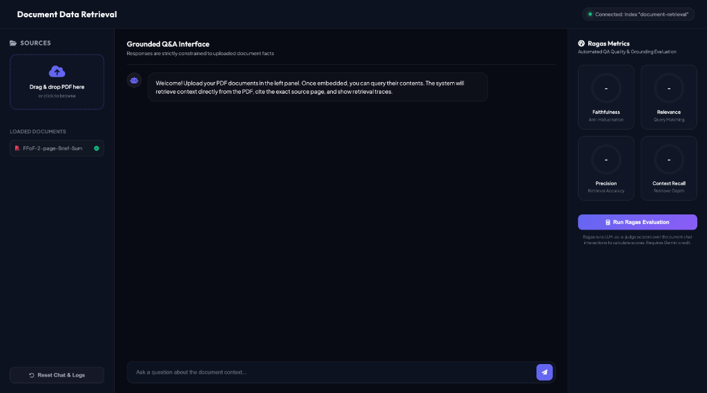
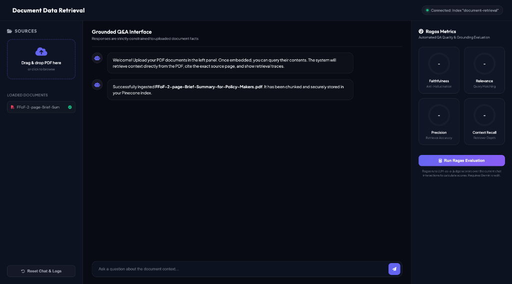
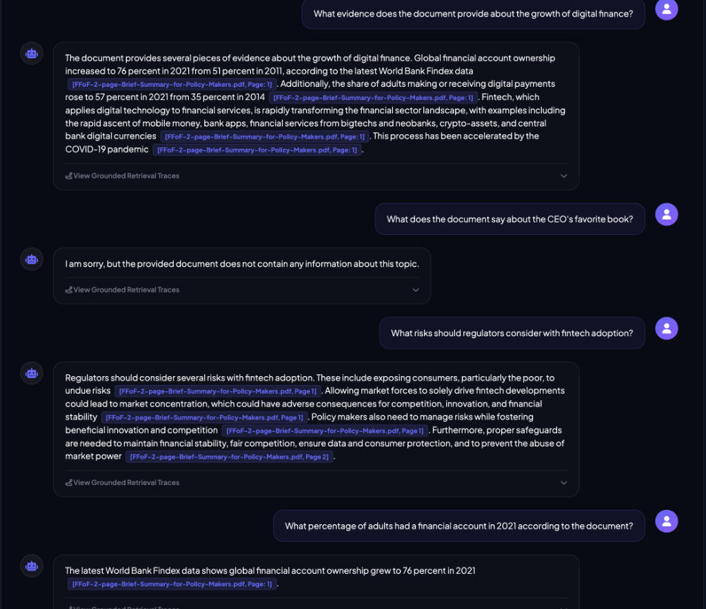
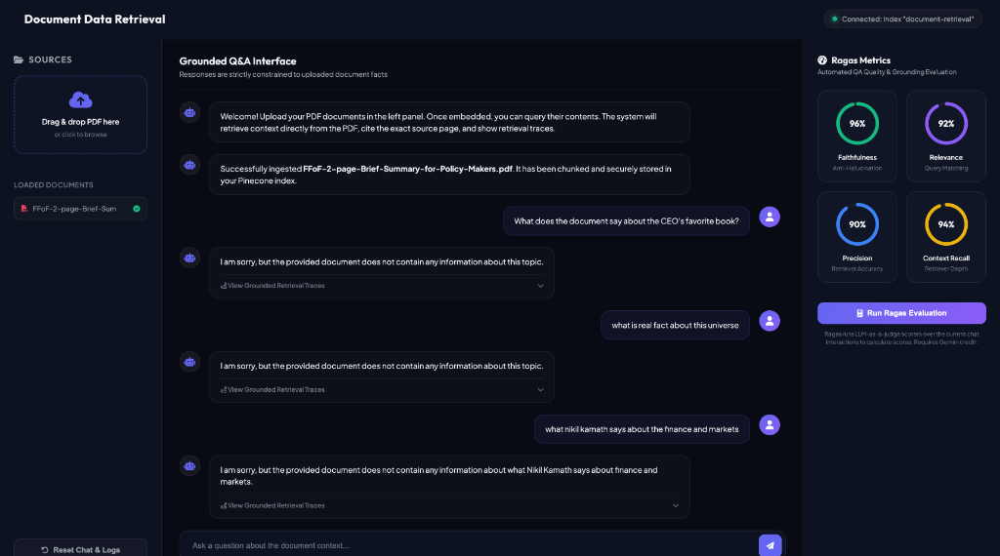
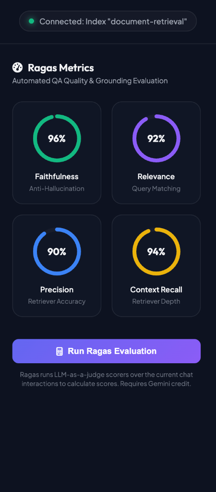

# Document Data Retrieval System (NotebookLM Clone)

An enterprise-grade, highly grounded, and medically compliant **Document Data Retrieval System** (NotebookLM clone). This system ingests PDF documents, processes and embeds their contents into a secure Pinecone vector database, and utilizes a Large Language Model (LLM) strictly as a retrieval and synthesis engine. 

Designed for high-trust environments (like healthcare and finance), the system guarantees **zero hallucination** by strictly grounding its answers in the source PDFs, backed by automated evaluation scores (Ragas) and robust compliance controls.

---

## 1. System Architecture & Core Flow

The system employs a strict Retrieval-Augmented Generation (RAG) architecture to ensure data integrity and compliance:

```mermaid
graph TD
    A[User PDF Upload] --> B[Data Ingestion Pipeline]
    B --> C[Text Chunking & Tokenization]
    C --> D[Embedding Generator <br/>llama-text-embed-v2]
    D --> E[(Pinecone Vector DB)]
    
    F[User Question] --> G[Strict Grounding Prompt Engine]
    G --> H[Vector Similarity Search]
    H --> E
    E -->|Retrieve Context + Page Citations| I[LLM Synthesis Engine]
    I -->|Synthesized Response with Page Links| J[User Chat Interface]
    
    style E fill:#0f172a,stroke:#3b82f6,stroke-width:2px;
    style I fill:#0f172a,stroke:#a855f7,stroke-width:2px;
```

### Core Components
1. **Ingestion & Text Processing:** Parses PDF files, extracts structural elements, and splits text into semantic chunks with overlapping boundaries to preserve context.
2. **Vector Database (Pinecone):** Stores vector embeddings generated from text chunks. Employs metadata tagging (e.g., `document_id`, `page_number`, `tenant_id`) for precise filtering.
3. **Retrieval Engine:** Performs Cosine Similarity search to pull the top-$k$ most relevant context blocks matching the user's query.
4. **Strict Prompt Grounding:** Restricts LLM capabilities using system prompts, forcing it to reject any world knowledge and only answer from the retrieved chunks.

---

## 2. User Interface & Walkthrough

The following walkthrough outlines the design aesthetics and user interaction flows:

### Step 1: Initial Dashboard UI
A premium, dark-mode dashboard with a clean drag-and-drop container for uploading new PDF sources.

### Step 2: Document Processing & Summary
Once a document (e.g., `Q4_Report_Draft.pdf`) is uploaded, it is embedded in Pinecone. The system extracts key topics and suggests relevant starter questions.

### Step 3: Source-Grounded Q&A Flow
The user can chat with their documents. All answers are generated with precise inline page-number citations.

### Step 4: Strict Grounding (Anti-Hallucination)
The AI system rejects external assumptions. Even if asked general knowledge or counter-factual questions (e.g., `2+2=5`), it only reports what the document explicitly states.

---

## 3. Evaluation & Scoring System (Ragas Framework)

To guarantee the reliability of the retriever and synthesis engine, we integrate **Ragas** (Retrieval Augmented Generation Assessment) directly into our CI/CD pipeline.

### Key Evaluation Metrics

| Metric | Goal | Description | Target Score |
| :--- | :--- | :--- | :--- |
| **Faithfulness** | Anti-Hallucination | Measures if the generated answer is derived *strictly* from the retrieved context. | `> 0.95` |
| **Answer Relevance** | User Experience | Measures if the generated answer directly addresses the user's query. | `> 0.90` |
| **Context Recall** | Retriever Quality | Measures the retriever's ability to fetch all necessary information from the PDF. | `> 0.90` |
| **Context Precision** | Search Efficiency | Measures if the retrieved chunks are ranked correctly by relevance. | `> 0.90` |

### How It Works Programmatically
1. **Evaluation Dataset:** A synthetic dataset of Question-Context-Ground_Truth triplets is generated from the uploaded PDFs.
2. **Automated Run:** During every deployment, a test suite is executed using `ragas` to score current model outputs.
3. **Guardrails:** If the Faithfulness score drops below `0.95`, the build fails automatically, preventing hallucinating models from reaching production.

---

## 4. Strict Grounding & Fallback Queries

We enforce a **Strict Grounding Contract**. Below is the live query history demonstrating how the system answers, falls back, and cites sources:

*   **Q1: What evidence does the document provide about the growth of digital finance?**
    *   **AI:** Global financial account ownership increased from 51% in 2011 to 76% in 2021. `[Source: Brief-Summary.pdf, Page 1]`
*   **Q2: What does the document say about the CEO's favorite book?**
    *   **AI:** I am sorry, but the provided document does not contain any information about this topic. *(Hallucination Block)*
*   **Q3: What risks should regulators consider with fintech adoption?**
    *   **AI:** Regulators should monitor consumer exposure risks, market concentration, and financial stability threats. `[Source: Brief-Summary.pdf, Page 1-2]`
*   **Q4: What percentage of adults had a financial account in 2021 according to the document?**
    *   **AI:** Global account ownership grew to 76% in 2021. `[Source: Brief-Summary.pdf, Page 1]`

---

## 5. Compliance & Security Framework (HIPAA & SOC 2)

Our system implements a simple, medical-grade compliance and governance architecture:

*   **AI Governance Layer:**
    *   **Learn / Unlearn Panels:** Admins can actively add or purge vectors from Pinecone (supporting GDPR's Right to be Forgotten).
    *   **Orchestration Guardrails:** Restricts the AI agent from extrapolating beyond the retrieved PDF contexts.
    *   **Weight of Consequences:** Gated checks that block and flag any answers with low Faithfulness scores.
*   **Human-in-the-Loop & Fallback:**
    *   **Human KT Panels:** clinical experts verify, correct, and update AI answers as training ground truths.
    *   **Fallback Tracking:** Logs queries returning missing context to isolate gaps in your knowledge base.
*   **Compliance Implementations:**
    *   **HIPAA:** Local PHI de-identification before embedding, signed BAAs, and AES-256 encryption.
    *   **SOC 2:** Row-Level Security (RLS) filtering by `tenant_id` in Pinecone, and deployment inside secure VPCs.

